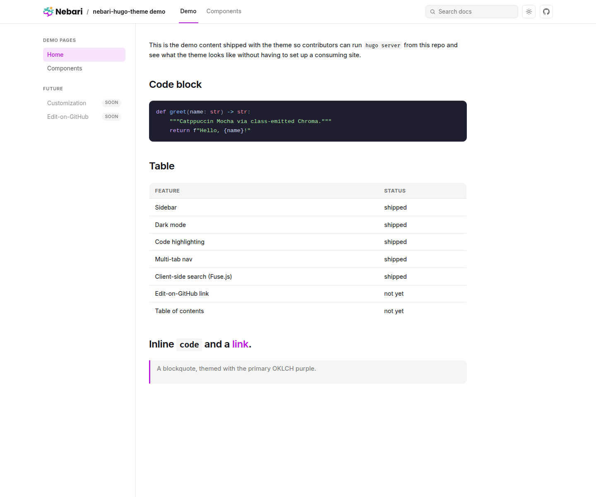
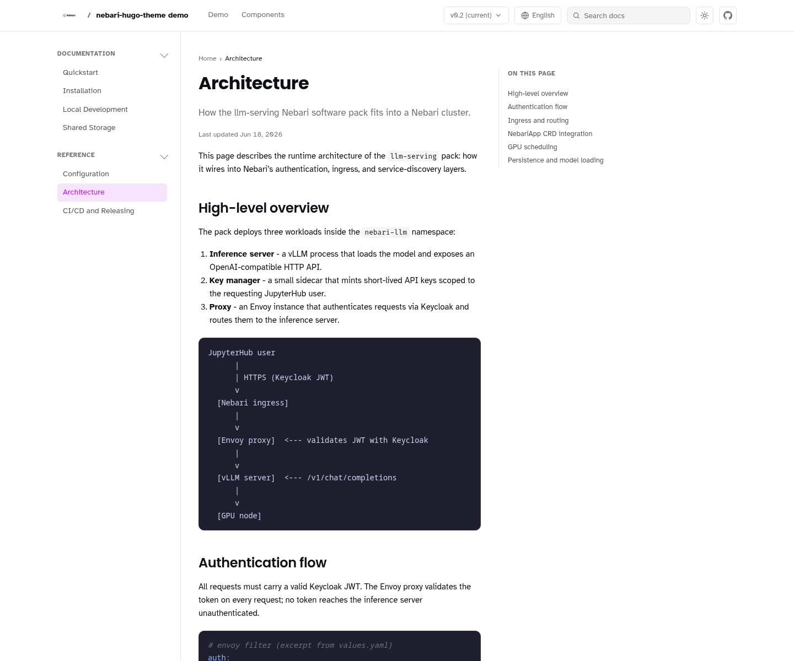
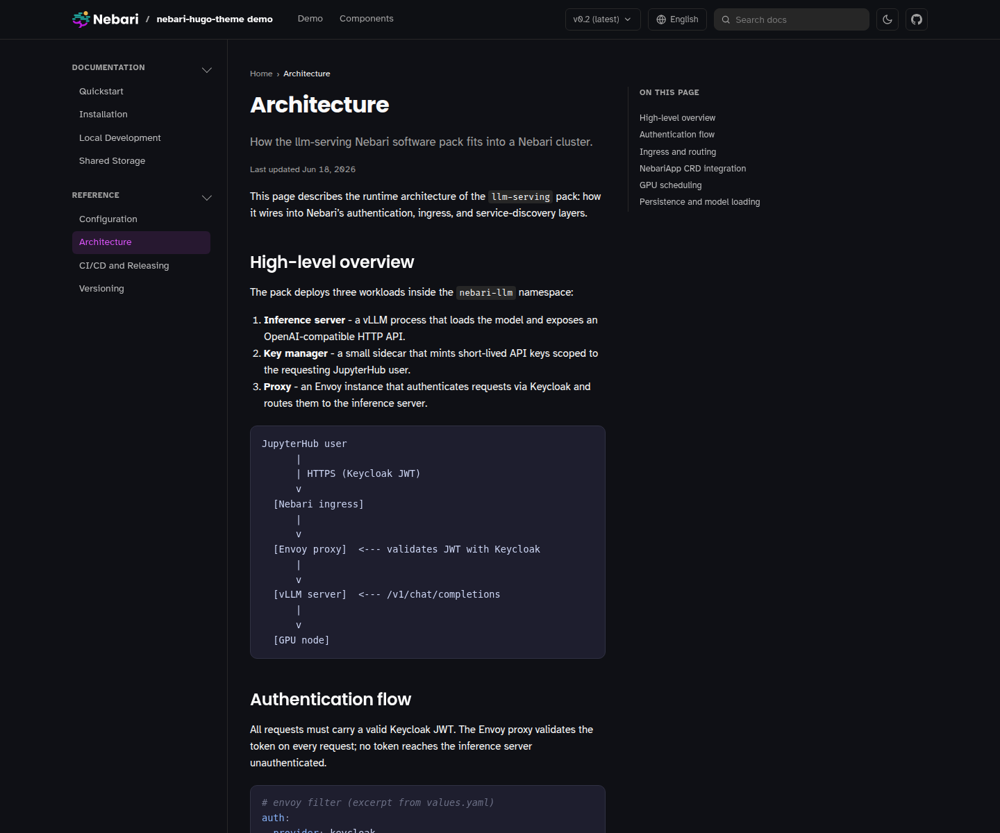
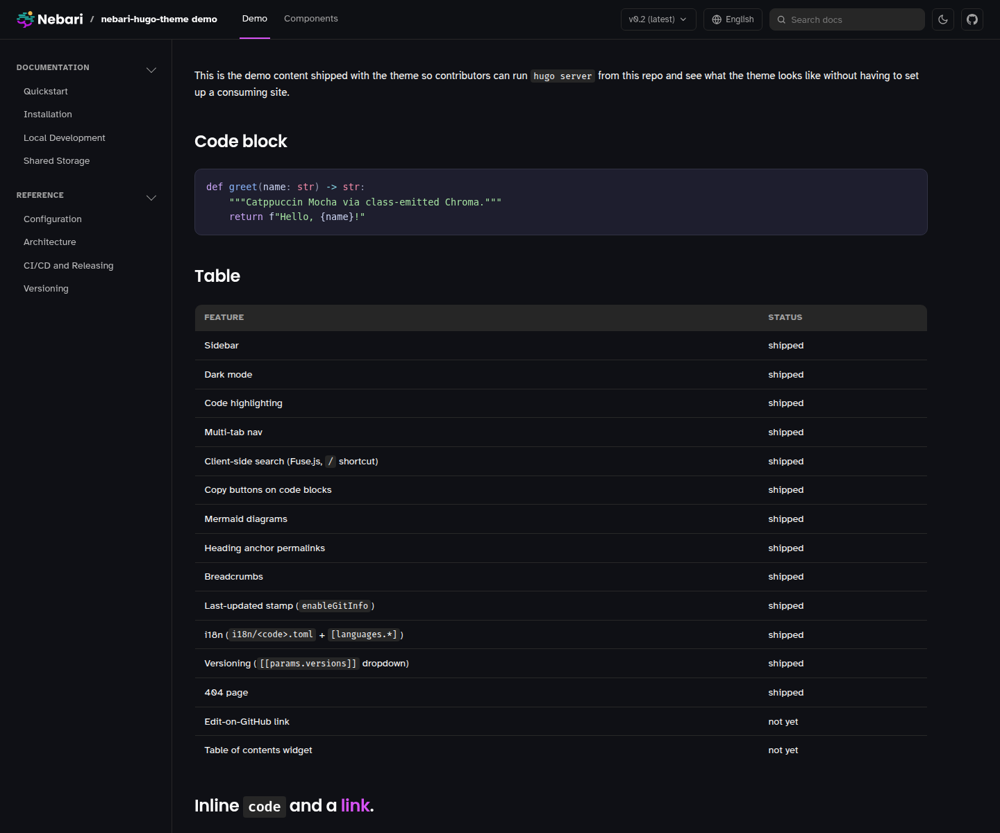
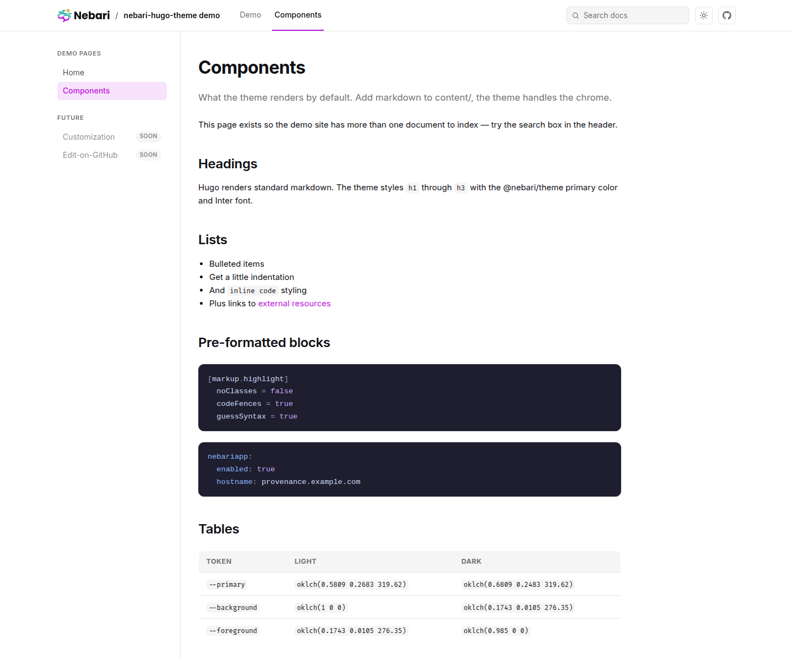
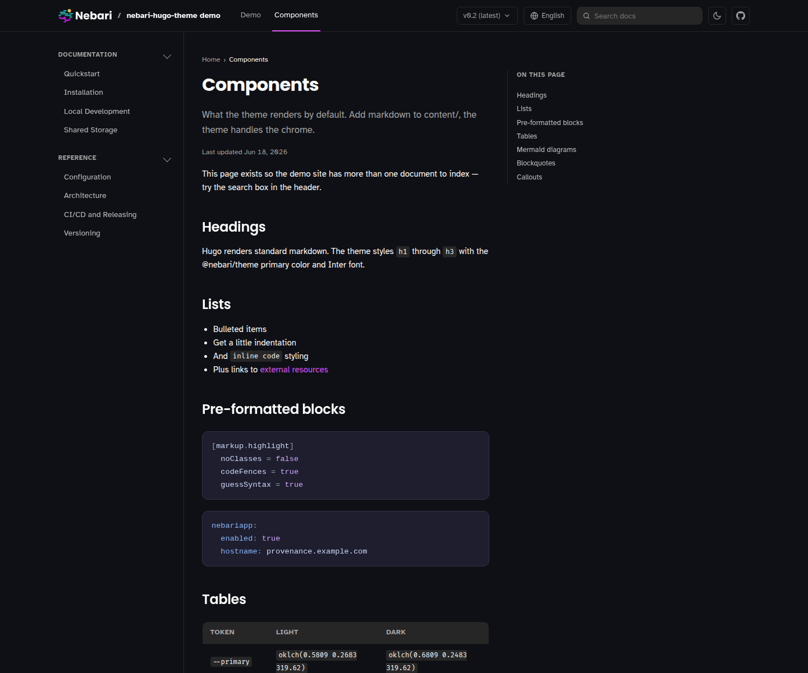
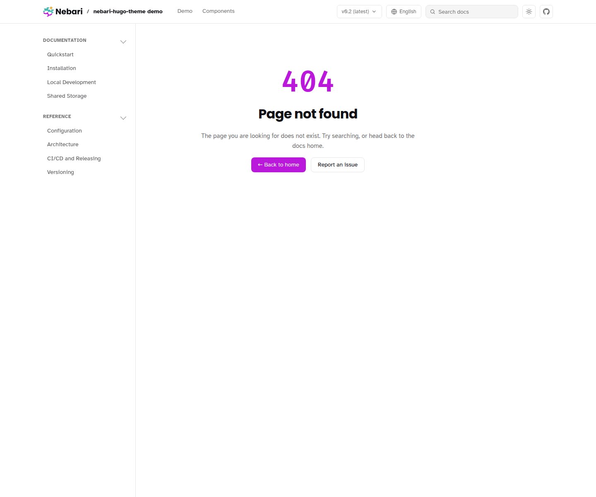
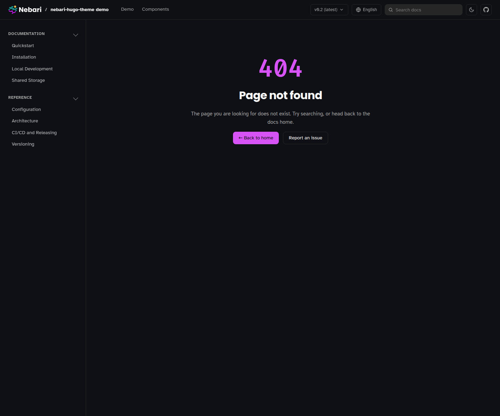
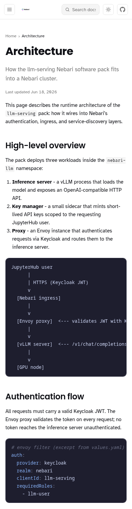

<p align="center">
  <a href="https://nebari.dev">
    <picture>
      <source media="(prefers-color-scheme: dark)" srcset="https://raw.githubusercontent.com/nebari-dev/nebari-design/main/logo-mark/horizontal/standard/Nebari-Logo-Horizontal-Lockup-White-text.png">
      <source media="(prefers-color-scheme: light)" srcset="https://raw.githubusercontent.com/nebari-dev/nebari-design/main/logo-mark/horizontal/standard/Nebari-Logo-Horizontal-Lockup.png">
      
    </picture>
  </a>
</p>

<h1 align="center">Nebari Hugo Theme</h1>

<p align="center">
  <strong>Minimal Hugo theme for Nebari software-pack documentation sites.</strong><br />
  Imports the OKLCH color tokens from <a href="https://github.com/nebari-dev/nebari-design">nebari-design</a>'s
  <code>@nebari/theme</code> so pack docs stay visually consistent with the rest of the Nebari ecosystem — header
  chrome, sidebar tree, multi-tab nav, client-side fuzzy search, dark mode, Catppuccin Mocha code blocks. Built
  around vanilla Hugo conventions so it stays small.
</p>

<p align="center">
  <picture>
    <source media="(prefers-color-scheme: dark)" srcset="docs/screenshots/hero-dark.png">
    <source media="(prefers-color-scheme: light)" srcset="docs/screenshots/hero-light.png">
    
  </picture>
</p>

<p align="center">
  <a href="https://github.com/nebari-dev/nebari-hugo-theme/blob/main/LICENSE"></a>
  <a href="https://gohugo.io"></a>
  <a href="https://www.typescriptlang.org"></a>
  <a href="https://github.com/nebari-dev/nebari-design"></a>
</p>

<p align="center">
  <a href="#what-is-nebari-hugo-theme">What is it?</a> &middot;
  <a href="#use-in-a-pack">Use in a pack</a> &middot;
  <a href="#local-preview">Local preview</a> &middot;
  <a href="#whats-shipped">What's shipped</a> &middot;
  <a href="#architecture">Architecture</a> &middot;
  <a href="#development">Development</a> &middot;
  <a href="https://nebari-dev.github.io/nebari-hugo-theme/"><strong>Live demo</strong></a>
</p>

> **Live demo**: [nebari-dev.github.io/nebari-hugo-theme](https://nebari-dev.github.io/nebari-hugo-theme/) —
> the `exampleSite/` in this repo, built and deployed to GitHub Pages on every push to `main`.
>
> **Status**: Early. Used by [`nebari-provenance-collector-pack`](https://github.com/nebari-dev/nebari-provenance-collector-pack)
> as the first consumer / shakedown site. Expect breaking changes until v0.1.

## What is Nebari Hugo Theme?

A small Hugo theme module that does **two things**:

1. **Imports the design tokens** from `@nebari/theme` so pack docs render with the same OKLCH palette, Poppins +
   Atkinson Hyperlegible typography (Fira Code for code), and primary purple as the rest of the Nebari ecosystem (the design library itself,
   `nebari-landing`, dashboards, future pack consumers).
2. **Owns the docs chrome** — header + sticky top nav with tabs + client-side search + sidebar tree with
   section grouping + dark-mode toggle + content / footer — so a consuming pack's repo only needs `content/*.md`
   and a 30-line `hugo.toml`.

Scope is intentionally narrow vs general-purpose Hugo doc themes (Doks, Hextra, Geekdoc): no in-browser LLM
assistant, no megamenu, no blog mode. Visual identity comes from `@nebari/theme` directly so packs inherit the
same OKLCH palette, Poppins + Atkinson Hyperlegible typography, and primary purple as the rest of the Nebari ecosystem (apps,
dashboards, the design system itself).

| | Light | Dark |
| :---: | :---: | :---: |
| Docs page |  |  |
| Home  |  |  |
| Inner |  |  |
| 404   |  |  |

A documentation page shows the grouped sidebar (collapsible **Documentation** / **Reference**
sections), the right-hand "On this page" table of contents with scroll-spy, breadcrumbs, and an
Edit-on-GitHub link. The layout is responsive — below 768px the sidebar collapses behind a
hamburger toggle:

<p align="center">
  
</p>

## Use in a pack

Add the theme as a Hugo Module in your pack's `hugo.toml`:

```toml
baseURL      = "https://nebari-dev.github.io/<your-pack>/"
languageCode = "en-US"
title        = "Your Pack Name"
theme        = ["github.com/nebari-dev/nebari-hugo-theme"]

[markup]
  [markup.highlight]
    noClasses   = false
    codeFences  = true
    guessSyntax = true
  [markup.goldmark.renderer]
    unsafe = true

# Enables client-side Fuse.js search — emits /index.json that search.ts fetches.
[outputs]
  home = ["HTML", "RSS", "JSON"]

[params]
  description = "One-line tagline shown under the title."
  repo        = "https://github.com/nebari-dev/<your-pack>"
  search      = true   # set to false to hide the search input
  # Optional: renders an "Edit this page on GitHub" link at the bottom of every
  # single page.  Set to the GitHub edit URL prefix up to (but not including)
  # the content-root path.  Example:
  editBase    = "https://github.com/nebari-dev/<your-pack>/edit/main/docs/content"

# Top-nav tabs. Active tab is determined by RelPermalink-prefix match.
[[params.tabs]]
  name = "Guides"
  url  = "/guides/"
[[params.tabs]]
  name = "Reference"
  url  = "/reference/"

# Sidebar tree.
[[params.sidebar]]
  heading = "Getting Started"
  [[params.sidebar.items]]
    label = "Overview"
    url   = "/"
  [[params.sidebar.items]]
    label = "Install"
    url   = "/install/"

[module]
  [[module.imports]]
    path = "github.com/nebari-dev/nebari-hugo-theme"
```

Initialize Hugo Modules in your pack repo:

```bash
hugo mod init github.com/nebari-dev/<your-pack>
hugo mod get -u
hugo server   # preview at http://localhost:1313
hugo          # build to public/
```

A consuming pack with this theme is shaped like:

```
docs/
  hugo.toml         # ~30 lines — title, sidebar tree, tabs
  go.mod            # generated by `hugo mod init`
  content/
    _index.md
    install.md
    …
  static/           # optional, pack-specific assets
```

That's the target footprint — pack maintainers ship docs content, the theme owns chrome.

### Versioned docs (without copying your docs)

The theme renders a version dropdown from `[[params.versions]]`. Each version is an
independently-deployed site — the current docs at the root, each past version under a
`/vX.Y/` subpath:

```toml
[[params.versions]]
  label   = "v0.2 (latest)"
  url     = "https://nebari-dev.github.io/<pack>/"   # cross-deploy URL, emitted verbatim
  current = true
[[params.versions]]
  label = "v0.1"
  url   = "https://nebari-dev.github.io/<pack>/v0.1/"
```

You never keep a `v0.1/` folder in your repo. Each version already exists as the **git
tag** you cut at release; CI rebuilds the current docs at the root and each tag into its
`/vX.Y/` subpath, then uploads one combined Pages artifact. The full recipe (and the
trade-offs) live on the demo's **[Versioning page](https://nebari-dev.github.io/nebari-hugo-theme/versioning/)**;
`exampleSite/`'s own deploy uses it to publish a working
[`/v0.1/`](https://nebari-dev.github.io/nebari-hugo-theme/v0.1/) snapshot.

## Local preview

Clone, then use the bundled `Makefile`:

```bash
git clone git@github.com:nebari-dev/nebari-hugo-theme.git
cd nebari-hugo-theme
make dev          # http://localhost:1313, live-reload, edits in assets/ + layouts/ pick up immediately
```

The `exampleSite/` directory is a real Hugo site that imports the parent directory as a theme via a `replace`
directive in `exampleSite/go.mod`, so every theme change shows up without re-publishing. Other targets:

| Target | What it does |
| --- | --- |
| `make dev` | `hugo server` against `exampleSite/` with live reload |
| `make build` | Build the example site to `exampleSite/public/` (sanity check) |
| `make screenshots` | Boot Hugo headless, capture light + dark PNGs into `docs/screenshots/` |
| `make tidy` | Refresh Hugo Modules (run after editing imports) |
| `make clean` | Remove `public/`, `resources/`, and other Hugo build artifacts |

The screenshots embedded above are captured exactly this way — `make screenshots` is part of the contributor
loop, not an out-of-band script.

## What's shipped

| Feature | Status | Source |
| --- | --- | --- |
| Header chrome (logo + tabs + actions) | shipped | `layouts/partials/header.html` |
| Sticky multi-tab top nav (`[[params.tabs]]`) | shipped | `layouts/partials/header.html` |
| Left sidebar with section grouping (`[[params.sidebar]]`) | shipped | `layouts/partials/sidebar.html` |
| Dark-mode toggle with FOUC prevention | shipped | `layouts/partials/head.html` + `assets/js/theme-toggle.ts` |
| Client-side fuzzy search (Fuse.js 7.1) with `/`-focus shortcut | shipped | `assets/js/search.ts` + `layouts/_default/index.json` |
| Copy buttons on every code block | shipped | `assets/js/copy.ts` |
| Mermaid diagrams (lazy-loaded from CDN) | shipped | `assets/js/mermaid-init.ts` |
| Heading anchor permalinks (`#` on hover) | shipped | `layouts/_default/_markup/render-heading.html` |
| Breadcrumbs (`Home › Section › Page`) | shipped | `layouts/partials/breadcrumbs.html` |
| Last-updated stamp (requires `enableGitInfo = true`) | shipped | `layouts/partials/last-updated.html` |
| i18n (`i18n/<code>.toml` + `[languages.*]` blocks) | shipped | `i18n/{en,es}.toml` + `layouts/partials/language-picker.html` |
| Versioning (`[[params.versions]]` dropdown) | shipped | `layouts/partials/version-picker.html` |
| Themed 404 page with home / report-issue actions | shipped | `layouts/404.html` |
| Catppuccin Mocha code highlighting (Chroma) | shipped | `assets/css/main.css` |
| Self-hosted Poppins (headings) + Atkinson Hyperlegible (body) + Fira Code (code) | shipped | `assets/css/main.css`, `static/fonts/` |
| `@nebari/theme` OKLCH token import | shipped | `assets/css/main.css` |
| Edit-on-GitHub link (`params.editBase`) | shipped | `layouts/partials/edit-link.html` |
| Table of contents widget (right sidebar) with scroll-spy | shipped | `layouts/partials/toc.html`, `assets/js/toc.ts` |
| Collapsible sidebar groups with persisted state | shipped | `layouts/partials/sidebar.html`, `assets/js/sidebar.ts` |
| Responsive layout — off-canvas drawer under 768px that re-surfaces tabs + version + language pickers | shipped | `assets/css/main.css`, `assets/js/nav-toggle.ts`, `layouts/partials/sidebar.html` |
| Horizontally scrollable tables on narrow screens | shipped | `layouts/_default/_markup/render-table.html`, `assets/css/main.css` |
| Theme behaviour tests (responsive nav, table wrapping) | shipped | `scripts/test-theme.sh` |
| Callout / admonition shortcode (note/tip/warning/caution) | shipped | `layouts/shortcodes/callout.html` |
| GitHub Pages build + deploy workflow | shipped | `.github/workflows/deploy.yml` |
| `prefers-reduced-motion` audit | not yet | — |

## Architecture

```
nebari-hugo-theme/
  assets/
    css/main.css                 OKLCH tokens + chrome + Chroma palette
    js/theme-toggle.ts           Dark-mode toggle (esbuild-compiled by js.Build)
    js/search.ts                 Fuse.js search wiring
    vendor/fuse.basic.min.mjs    Vendored Fuse 7.1 (~13 KB)
  layouts/
    _default/
      baseof.html                Page shell; bundles + SRI-hashes the TS modules
      home.html / single.html / list.html
      index.json                 Search-index template (one record per RegularPage)
    partials/
      head.html                  Meta + FOUC-prevention script + CSS link
      header.html                Logo + tabs + search + theme toggle + GitHub
      sidebar.html               Sidebar tree from [[params.sidebar]]
      footer.html
  exampleSite/                   Consumer-shape demo for local preview
  docs/screenshots/              README hero images, regenerated by `make screenshots`
  Makefile
  theme.toml                     Theme metadata for Hugo's theme catalog
  go.mod                         Hugo Module init
```

The two TS modules are compiled through Hugo's built-in `js.Build` (esbuild) in `baseof.html` and shipped as ES
modules with SRI integrity hashes. `tsconfig.json` is present for editor support — Hugo handles the actual build.

## Development

Requirements:

- **Hugo extended ≥ 0.116** — needs the `js.Build` (esbuild) pipeline
- **Go ≥ 1.20** — for Hugo Modules
- **Node** — not required; TS goes through Hugo, not npm

Quick loop:

```bash
make dev                       # live preview
# … edit assets/, layouts/, content in exampleSite/content/ …
make screenshots               # regenerate README images when chrome changes
make test                      # run theme behaviour tests (also runs in CI)
make check-readme              # verify README still matches the repo (also runs in CI)
git commit -am "feat: …"
```

Contributions welcome — open a PR. The theme follows
[Hugo's theme conventions](https://gohugo.io/hugo-modules/theme-components/) and tries to keep its scope narrow:
if a feature is more pack-specific than docs-theme-specific, it probably belongs in the consuming pack instead.

## Acknowledgements

[`@nebari/theme`](https://github.com/nebari-dev/nebari-design) — the OKLCH token source-of-truth. Refresh the
copied tokens in `assets/css/main.css` when upstream changes.

## License

[Apache 2.0](LICENSE) — same as the rest of the Nebari Infrastructure Core stack.
